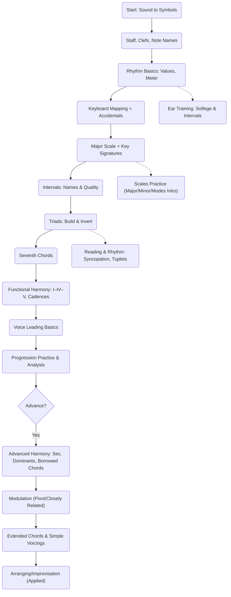

# Western Music Theory — Beginner — Lesson Guide

## Purpose
A structured, engaging path to learn core Western music theory from first principles to advanced harmony, aligned with Unlock Music's interactive components and practice UX.

- Lesson ID: `western-theory-intro`
- Audience: Beginners through advancing self-learners
- Prerequisites: None (ear training is integrated gradually)

## Learning Outcomes
By the end of this lesson track, learners will be able to:
- Read staff notation at a beginner level and map notes to the keyboard.
- Understand pitch, rhythm, meter, scales, and key signatures.
- Build and identify triads and seventh chords; recognize basic functional harmony.
- Analyze simple progressions and cadences; perform basic voice leading.
- For advanced learners, apply secondary dominants, modal interchange, and simple modulations.

## Syllabus by Level

### Basic Topics (Foundations)
- Notation & Staff
  - Clefs (treble, bass), ledger lines, note names A–G
  - Accidentals (sharps, flats, naturals), enharmonics
- Pitch & Keyboard Mapping
  - Middle C, octaves, chromatic vs diatonic notes
  - Keyboard geography; note-to-key mapping
- Rhythm & Meter
  - Note values, rests, ties, dotted notes
  - Simple meters (2/4, 3/4, 4/4), tempo basics, subdivision
- Intervals (Intro)
  - Half/whole steps, naming (2nd, 3rd, ...), consonance vs dissonance (intuitive)
- Scales & Key Signatures (Intro)
  - Major scale pattern (W-W-H-W-W-W-H)
  - Circle of fifths (conceptual), reading simple key signatures
- Ear Training (Starter)
  - Note recognition by letter names; identify melodic direction and intervals

### Intermediate Topics (Application)
- Minor Scales & Modes (Overview)
  - Natural, harmonic, melodic minor; modal flavor (Ionian to Locrian)
- Intervals (Functional)
  - Quality (major/minor/perfect/aug/dim), inversion, compound intervals
- Triads & Seventh Chords
  - Major/minor/diminished/augmented triads; inversions
  - Seventh chords (maj7, 7, m7, m7b5), figured-bass style thinking
- Functional Harmony (I-IV-V etc.)
  - Tonic, predominant, dominant functions; basic cadences (authentic, half, plagal)
  - Common progressions: I-V-vi-IV, ii-V-I
- Voice Leading (Intro)
  - Smooth motion, avoid parallels, chordal tendency tones (3rd, 7th)
- Rhythm & Reading (Applied)
  - Syncopation, ties across barlines, triplets/tuplets
- Analysis & Transposition
  - Roman numerals, scale-degree thinking; transpose simple melodies

### Advanced Topics (Expansion)
- Advanced Harmony
  - Secondary dominants/leading-tone chords (V/V, vii°/V)
  - Borrowed chords (modal interchange: bVII, iv, bVI)
  - Extended chords (9ths, 11ths, 13ths) and basic voicing
- Modulation (Intro)
  - Pivot-chord modulation to closely related keys; tonicization vs modulation
- Counterpoint (Essentials)
  - Species basics; melodic contour and independence (conceptual)
- Rhythm & Meter (Advanced)
  - Compound meters (6/8, 9/8), mixed/odd meters, hemiola
- Arranging & Improvisation (Applied)
  - Harmonizing a melody; guide tones; voice-leading shells
- Analysis (Deeper)
  - Phrase structure, period vs sentence; form (binary/ternary, 12-bar blues skeleton)

## Learning Curve (Flow Chart)

## Lesson Structure in App
- Intro section: One-screen overview, goal for 2 minutes, "Start Now" CTA
- Collapsible modules mapping to topics above (Basic -> Intermediate -> Advanced)
- Embedded interactive pieces:
  - Keyboard visualization for pitch mapping and intervals
  - Scale player (major/minor/modes) for hearing/seeing structures
  - Chord builder for triads/sevenths with voice-leading demos
- Practice panel: streaks, session timer, micro-goal slider (2/5/10 min)

## Psychology-Backed Learning Strategy
Grounded in cognitive science and music pedagogy; designed for smooth, durable learning.

- Spaced Repetition (Cepeda et al., 2006)
  - Schedule concept refreshers over days/weeks; resurface key signatures and intervals.
- Retrieval Practice (Karpicke & Roediger, 2008)
  - Quick quizzes: identify key, name chord quality; immediate feedback.
- Interleaving (Rohrer & Taylor, 2007)
  - Mix tasks (interval ID, rhythm clap, chord build) to improve transfer vs blocked practice.
- Deliberate Practice (Ericsson, 1993)
  - Pinpoint weak spots (e.g., diminished intervals) with short, focused drills and feedback.
- Desirable Difficulties (Bjork, 1994)
  - Slightly vary tempo/keys, hide labels occasionally to boost retention.
- Chunking (Miller, 1956; Chase & Simon, 1973)
  - Group notes into patterns (scale degrees, chord tones) to reduce cognitive load.
- Dual Coding / Multimodal (Paivio, 1991)
  - Couple sound, symbol, and keyboard visualization concurrently.
- Growth Mindset (Dweck, 2006)
  - Celebrate effort and strategies; normalize slow-to-fast improvement.
- Motivation & Habit Formation (Fogg, 2019; Lally et al., 2010)
  - Micro-commitments (2-min sessions), streaks, gentle exit nudges to build consistency.
- Focus & Flow (Csikszentmihalyi, 1990)
  - Focus Mode during playback; one clear next action; minimize UI clutter.

### How the App Implements This
- Micro-Goals: 2/5/10-minute presets; completion ring on detail screen
- Progress Visibility: "You practiced X mins" + streak save countdown
- Interleaved Practice: rotating mini-tasks (interval -> chord -> rhythm)
- Just-in-Time Tips: context-aware 1-liners after brief idle
- Exit Nudge: "2-min win before you go?" to protect streaks
- Resume: last key, tempo, and module persist; 1-tap continue

## Suggested Exercises
- Basic: Identify note names on staff and keyboard; clap simple rhythms; build C/G major scales
- Intermediate: Name intervals (audio + notation); build/invert triads; analyze I-IV-V in 3 keys
- Advanced: Add V/V to a I-vi-ii-V progression; harmonize an 8-bar melody; pivot-chord modulation

## Assessment & Acceptance Criteria
- A learner can complete a 2-minute guided session with at least one correct retrieval per module
- 80% accuracy on basic note and rhythm quizzes over two spaced sessions
- Build and identify triads and sevenths in three keys within 90 seconds
- Explain function (T-PD-D) in a 4-chord progression and choose a cadence type
- Perform one simple pivot-chord modulation example (guided)

## Assets & Components
- Components: `WesternMusicTheoryComponent`, `PianoView`, scale/chord builders
- Audio: `/server/public/instruments/piano/{NOTE}.mp3` for audition; scale/chord demo clips optional

## Out of Scope (for this lesson)
- Advanced orchestration, extensive jazz reharmonization, atonal set theory
- DAW/production techniques (may appear in separate tracks)

## References (Selected)
- Bjork, R. (1994). Memory and metamemory considerations in the training of human beings.
- Cepeda, N. J., et al. (2006). Distributed practice in verbal recall tasks.
- Csikszentmihalyi, M. (1990). Flow: The Psychology of Optimal Experience.
- Dweck, C. (2006). Mindset: The New Psychology of Success.
- Ericsson, K. A., et al. (1993). The role of deliberate practice in the acquisition of expert performance.
- Fogg, B. J. (2019). Tiny Habits.
- Karpicke, J. D., & Roediger, H. L. (2008). The critical importance of retrieval practice in long-term retention.
- Lally, P., et al. (2010). How are habits formed: Modelling habit formation.
- Paivio, A. (1991). Dual coding theory.
- Rohrer, D., & Taylor, K. (2007). The shuffling of mathematics problems improves learning.

---

Tip: Pair this with the interactive Scales and Piano Visualization to reinforce symbol-sound-action links.
