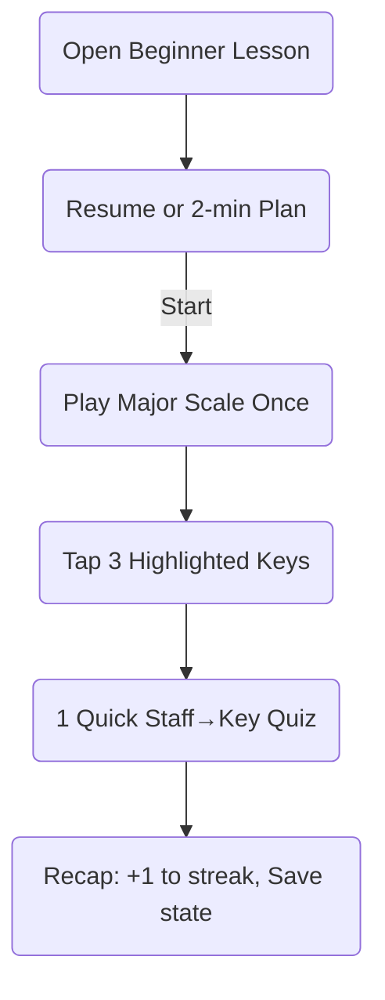

# Western Music Theory — Beginner: UX Plan

## Goal
Design an intuitive, low-friction experience that helps beginners understand core theory concepts through short, interactive simulations: see it, hear it, try it.

- Lesson ID: `western-theory-intro`
- Pairs with: `docs/western-intro-theory.md`
- Target session: 2–10 minutes (micro to short sessions)

## UX Principles
- One clear action per view (Play, Tap, Identify)
- Audio + Visual together (staff ↔ keyboard ↔ sound)
- Tiny steps with instant feedback and no dead-ends
- Progress is visible and recoverable (resume last point)

## Topic → UX Mapping
| Topic | UX Component | Interaction | Simulation | Example Prompt |
|---|---|---|---|---|
| Notation & Staff | StaffView (Treble/Bass toggle) | Tap notehead → hear pitch; hover/press to see name | Highlight ledger lines; animate placement from middle C | "Tap the note E4 on the treble staff." |
| Pitch & Keyboard Mapping | PianoView (C4–B5) | Tap key → show staff note and name; or tap staff → highlight key | Middle C anchor badge; octave markers | "Tap the key that matches this staff note." |
| Rhythm & Meter | RhythmPad | Tap/clap along to metronome; visualize durations | Animate note values filling a bar; dotted/tie demos | "Hold this note for a dotted half in 3/4." |
| Intervals (Intro) | IntervalTrainer | Select note A → preview up/down half/whole steps | Hear and see semitone vs whole tone | "Move from C to a whole step above." |
| Scales & Key Signatures | ScaleStepper + KeySignatureWheel | Choose key → step through W–W–H… sequence | Animate tonic-to-tonic path; show key signature accidentals | "Build G major from G4. Step through and play." |
| Ear Training (Starter) | Call-and-Response Mini | App plays 2–3 notes; user taps back on piano | Lightweight, immediate correctness feedback | "Repeat: do–re–mi." |

## Screen Structure (Collapsible)
1) Header
- Title, short purpose, music system badge, difficulty
- Resume CTA (shows saved key/signature and last module)

2) Quick Start (expanded by default)
- "2‑min plan": Play major scale in current key once + tap 3 highlighted keys
- Start button begins guided flow

3) Modules (collapsible sections)
- Staff & Note Names
- Keyboard Mapping
- Rhythm & Meter
- Intervals (Intro)
- Major Scale & Key Signatures
- Ear Training Mini

4) Practice Panel (collapsible)
- Streak, session timer, micro‑goal slider (2/5/10)
- Tip of the moment (contextual)

## Detailed Interactions
### Staff & Note Names
- StaffView shows treble by default; toggle to bass
- Tapping a note: plays audio, shows note name, highlights corresponding key on PianoView
- Micro-quiz: "Find F5" (3 attempts → gentle hint with ledger line overlay)

### Keyboard Mapping
- PianoView with labels on C-only by default (reduce clutter)
- Tap a key: shows note on staff, plays sound, shows octave (e.g., C4)
- Micro-quiz: app shows staff note → learner taps key

### Rhythm & Meter
- Choose meter (2/4, 3/4, 4/4)
- Tap durations into the bar; visual bar fills; metronome available
- Dotted note and tie toggle to show/practice variants

### Intervals (Intro)
- Start from tonic (default C4). Two buttons: Half Step / Whole Step
- Pressing a button plays the movement and shows both notes on staff & keyboard
- Micro-quiz: "Move from D to a whole step above" → learner taps E

### Scales & Key Signatures
- KeySignatureWheel (simple circle-of-fifths ring): choose key
- ScaleStepper displays W–W–H–W–W–W–H with next button to advance
- Play scale ascending; final note shows octave wrap (e.g., C4→C5)
- Show key signature accidentals in StaffView dynamically

### Ear Training Mini
- App plays 3-note pattern in the selected key
- Learner reproduces on PianoView; immediate correctness with gentle cues
- Keep it sub‑30s to stay lightweight

## Components (proposed/used)
- Existing: `PianoView`, audio player, collapsible panels
- New (proposed):
  - `StaffView` props: { clef: 'treble'|'bass'; highlight?: Note; keySignature?: string; onTapNote?: (note) => void }
  - `RhythmPad` props: { meter: '2/4'|'3/4'|'4/4'; tempo: number; onBeat?: (n) => void }
  - `IntervalTrainer` props: { start: Note; onAnswer: (correct:boolean) => void }
  - `ScaleStepper` props: { key: string; pattern: number[]; onStep?: (note) => void }
  - `KeySignatureWheel` props: { selectedKey: string; onChange: (key) => void }

Note format: scientific (e.g., C4, F#4). Keys: match existing `ALL_KEYS` and label logic.

## Micro-Session Flow

## Feedback & Guidance
- Correct tap: brief glow + pleasant tone
- Incorrect: nudge highlight and a one-line tip (no harsh buzzers)
- Idle 10–15s: show one context tip ("Try finding middle C first")

## Persistence
- Save last: key, clef, tempo, last open module, wheel position
- Resume takes learner back in <300ms

## Accessibility & Performance
- Large tap targets (>44px), high contrast themes
- Sound on by default; captions for note names; reduce motion toggle
- Preload next audio note while current plays

## Examples & Simulations
- Staff→Keyboard demo: tap G4 on staff, see G key highlight, hear G4
- Interval demo: from C4, half-step up shows C#4/D♭4 and plays it
- Scale demo: animate steps; on octave wrap, show C5 label clearly

## Acceptance Criteria
- Learner completes 2‑min plan with one tap
- Staff note tap plays audio and highlights correct key
- Scale player shows correct accidentals for selected key signature
- Interval half/whole step quiz provides immediate, clear feedback
- State persists and resumes exactly where the learner left off

## Tech Notes
- Reuse `PianoView` for all pitch interactions; extend with note-to-staff mapping
- iOS: ensure `expo-av` volume and silent mode settings as configured
- Assets: use `/server/public/instruments/piano/{NOTE}.mp3` for audition; no OGG on iOS

---

This UX plan focuses on tiny, satisfying wins to build confidence and momentum in the first week.
